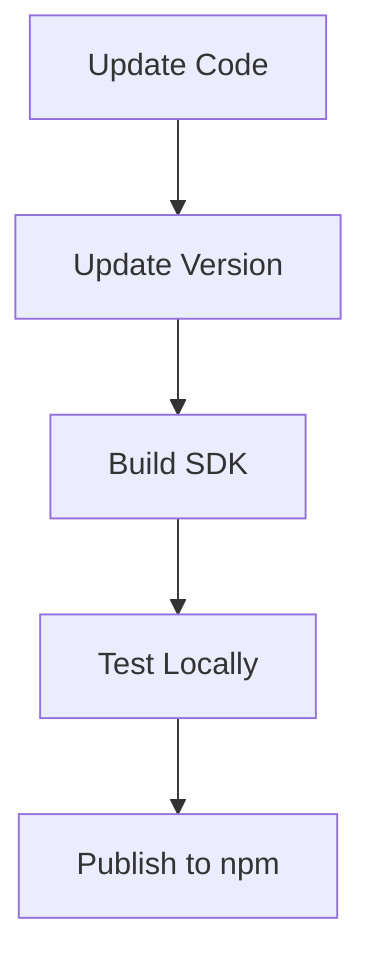

# Binary Bridges UI & SDK Documentation

## Table of Contents
1. [Live Environments](#live-environments)
2. [UI Application Setup](#ui-application-setup)
3. [TypeScript Axios Client SDK](#typescript-axios-client-sdk)
4. [Deployment](#deployment)
5. [API Integration](#api-integration)

---

## Live Environments
### Web Application
🌐 **UI Application**: [https://binary-bridges-ui.onrender.com/](https://binary-bridges-ui.onrender.com/)

### Production API
🔗 **API Endpoint**: [https://binary-bridges-api.onrender.com/](https://binary-bridges-api.onrender.com/)  
📚 **API Documentation**: [Swagger UI](https://binary-bridges-api.onrender.com/swagger-ui/index.html)  
⚙️ **OpenAPI Spec**: [v3 API Docs](https://binary-bridges-api.onrender.com/v3/api-docs)


## UI Application Setup

To set up the Binary Bridges UI application:

```bash
# Clone the repository
git clone https://github.com/qossayrida/binary-bridges-ui.git
cd binary-bridges-ui

# Install dependencies
npm install

# Start development server
npm run dev

# Build for production
npm run build

# Preview production build
npm run preview
```

### Environment Variables
Create a `.env` file in the root directory:
```env
VITE_API_BASE_URL=https://binary-bridges-api.onrender.com
```


## TypeScript Axios Client SDK


1. Navigate to the SDK directory:
```bash
cd binary-bridges-typescript-axios-client-sdk
```

2. Install dependencies:
```bash
npm install
```

3. Build the SDK:
```bash
npm run build
```

4. Test locally using dry-run:
```bash
npm pack --dry-run
```

5. Publish the SDK to npm:
```bash
npm publish --access public
```

#### Publishing Workflow


## Deployment

### Render.com Deployment

1. Configure `render.yaml`:
```yaml
services:
  - type: web
    name: binary-bridges-ui
    env: node
    buildCommand: npm install && npm run build
    startCommand: node server.js
    healthCheckPath: /
    envVars:
      - key: PORT
        value: 10000
      - key: VITE_API_BASE_URL
        value: https://binary-bridges-api.onrender.com
```

2. Push changes to trigger deployment:
```bash
git add .
git commit -m "Update for deployment"
git push origin main
```


## API Integration

### Using the SDK in Your Project

1. Install the SDK:
```bash
npm install @binary-bridges/binary-bridges-axios-client-api

# or use 
rm -rf node_modules package-lock.json
npm cache clean --force
npm install
```

2. Import and use:
```typescript
import { BaseAPI } from '@binary-bridges/binary-bridges-axios-client-api';

const apiClient = new BaseAPI();

// Example usage
apiClient.getAuthors();
```

